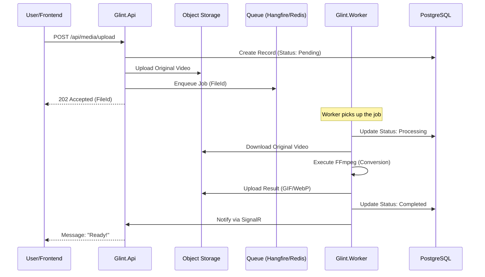

# 🏗️ System Architecture

Detailed overview of the Glint processing pipeline and service interaction.

## 🔄 Sequence Flow

The following diagram illustrates the end-to-end flow from video upload to real-time notification.

---

## 🧩 Core Components

- **Glint.Api:** The entry point for all client requests, managing file uploads and status tracking.
- **Glint.Worker:** A background service dedicated to high-performance video processing using FFmpeg.
- **Redis:** Acts as both the job queue (Hangfire) and the real-time backplane (SignalR).
- **Object Storage:** Stores both original uploads and processed assets.
- **PostgreSQL:** Maintains application state, file metadata, and processing history.

---
*Built with ❤️ for the developer community*
